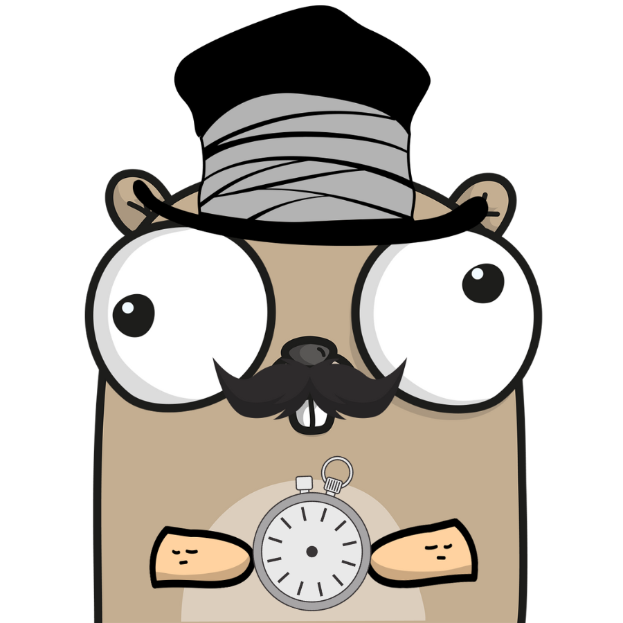

# Godot
a simple tool for enqueuing commands and executing them one by one.

> Same as executing a bunch of commands in a terminal, separated by `;`, but with some extra features.

<!-- add image below -->


If you want to take a break from your computer, but you have a bunch of long-running scripts to launch, just let `godot` do the job for you.

## Installation
```go
$ go install github.com/jeorjebot/godot
```
The binary will be installed in your `$GOPATH/bin` directory.


## Quick Start
Just add `godot add` before the command you want to execute, and `godot` will do the rest.


## Usage
```
Usage: godot <command>

Flags:
  -h, --help    Show context-sensitive help.

Commands:
  add <command> ...
    Add a new task.

  list
    List the tasks of this session.

  history
    List the tasks of past sessions.

  task add <command> ...
    Alias of the add command.

  task rm <taskID>
    Remove a specific task.

  task get <taskID>
    Retrieve a specific task with all details.

  clean
    Remove all logs and history.

  version
    Print version information and quit.

```
Everything you need to know is in the help message.

During the first execution, **godot** will create a directory in your home directory called `.godot` and a file called `godot_history.log` inside it. This file will contain all the tasks you will add.

## Client and Server
The first invocation of `godot` starts also the `godot` server, which will execute the tasks you added (or the command you prompted). 

If no tasks are enqueued, or if all the tasks are completed, the server will shutdown in 1 minute.

Every time you add a task, you behave like a client, and the server will execute the tasks in the order they were added.

## Examples

<!-- add a video here -->

### Add a task
```go
$ godot add touch file1.txt file2.txt
```
This command will add a new task to the queue. If this is the first task, it will also start the `godot` server and execute the task. The server will occupy the terminal until the task is completed.

### List the tasks
```go
$ godot list
```
This command will list all the tasks of the current session.

### List the tasks of past sessions
```go
$ godot history
```
This command will list all the tasks of past sessions.

### Manage long-running tasks
Long running tasks can output a lot of text in the terminal. If you want to see the output of a task, you can access the corresponding log file.

First, add the long-running task to the queue:
```go 
$ godot add long-running-task
```
Then, list the tasks:
```go
$ godot list
```

> You can also get the specific task with the `godot task get <taskID` command:
```go
$ godot task get 1
```

Finally, you have to open the log file of the task:
```bash
$ tail -f ~/.godot/123456789.log
```